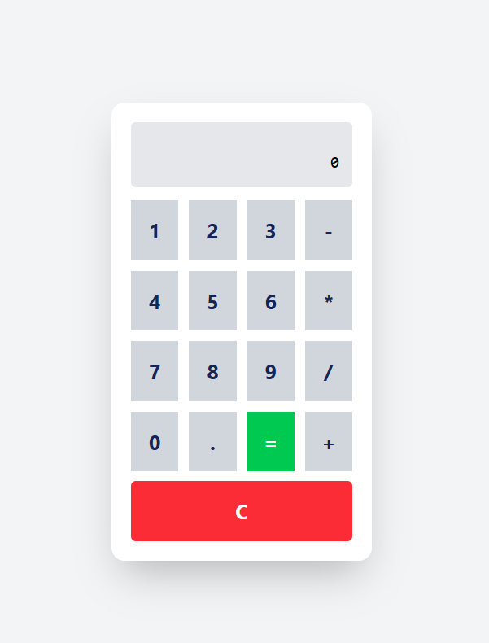

# 🔢 Basic Calculator

A simple, responsive calculator built using **React**, **JavaScript**, **HTML**, and **Tailwind CSS**. This project allows users to perform basic arithmetic operations like addition, subtraction, multiplication, and division with a clean and modern UI.

---

## 🚀 Features

- Perform basic calculations: addition, subtraction, multiplication, and division
- Responsive and mobile-friendly design
- Real-time input display
- Clear and delete functionality
- Built using modern React hooks
- Styled with Tailwind CSS

---

## 🛠️ Built With

- [React](https://reactjs.org/)
- [JavaScript](https://developer.mozilla.org/en-US/docs/Web/JavaScript)
- [Tailwind CSS](https://tailwindcss.com/)
- HTML5

---

## 📸 Screenshots

---

## 📂 Folder Structure

Currently, two official plugins are available:

- [@vitejs/plugin-react](https://github.com/vitejs/vite-plugin-react/blob/main/packages/plugin-react) uses [Babel](https://babeljs.io/) for Fast Refresh
- [@vitejs/plugin-react-swc](https://github.com/vitejs/vite-plugin-react/blob/main/packages/plugin-react-swc) uses [SWC](https://swc.rs/) for Fast Refresh

## Expanding the ESLint configuration

If you are developing a production application, we recommend using TypeScript with type-aware lint rules enabled. Check out the [TS template](https://github.com/vitejs/vite/tree/main/packages/create-vite/template-react-ts) for information on how to integrate TypeScript and [`typescript-eslint`](https://typescript-eslint.io) in your project.
